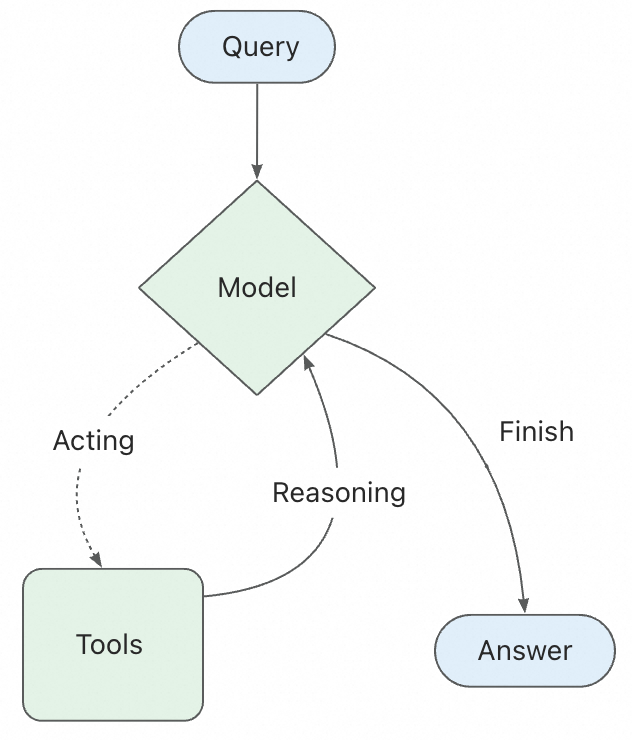
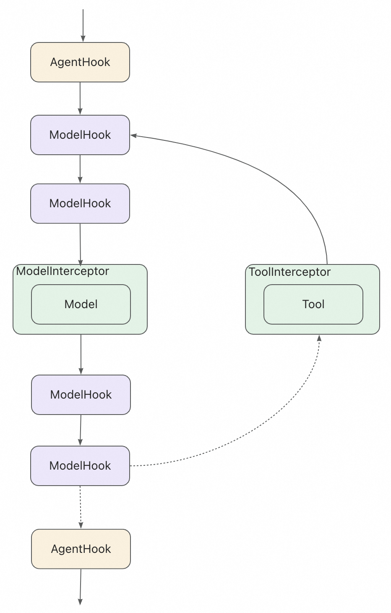
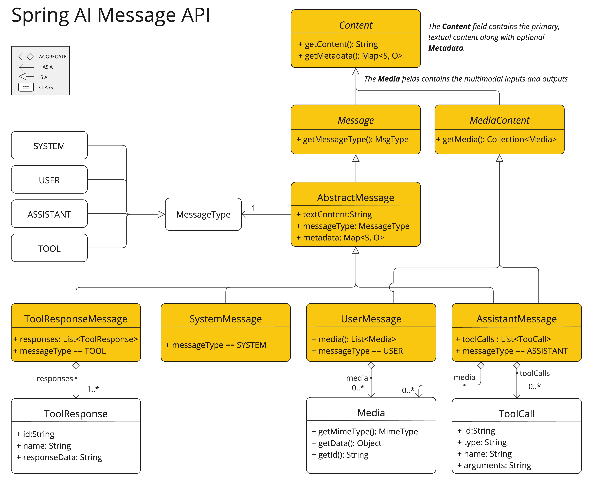

# [mock_springAI](mock_springAI)
大模型Mock启动前，需要先设置环境变量。
```AI_DASHSCOPE_API_KEY=sk-xxxxxxxxxxxxxxxxxxxxxxxxxxxxxxxx```


# ReactAgent
ReAct（Reasoning + Acting）是一种将推理和行动相结合的 Agent 范式。在这个范式中，Agent 会：

- 思考（Reasoning）：分析当前情况，决定下一步该做什么
- 行动（Acting）：执行工具调用或生成最终答案
- 观察（Observation）：接收工具执行的结果
- 迭代：基于观察结果继续思考和行动，直到完成任务
  
## ReactAgent 的核心执行流程：



# Hooks 和 Interceptors
Hooks 和 Interceptors 提供了一种更精细控制 Agent 内部行为的方式。


## Hooks 和 Interceptors 能做什么
- 监控: 通过日志、分析和调试跟踪 Agent 行为
- 修改: 转换提示、工具选择和输出格式
- 控制: 添加重试、回退和提前终止逻辑
- 强制执行: 应用速率限制、护栏和 PII 检测

## 内置实现
### SummarizationHook（消息压缩）
当接近 token 限制时自动压缩对话历史。

适用场景：
- 超出上下文窗口的长期对话
- 具有大量历史记录的多轮对话
- 需要保留完整对话上下文的应用程序

### ModelCallLimitHook（人机协同）
暂停 Agent 执行以获得人工批准、编辑或拒绝工具调用。

适用场景：
- 需要人工批准的高风险操作（数据库写入、金融交易）
- 人工监督是强制性的合规工作流程
- 长期对话，使用人工反馈引导 Agent

### ModelCallLimitHook（模型调用限制）
限制模型调用次数以防止无限循环或过度成本。

适用场景：
- 防止失控的 Agent 进行太多 API 调用
- 在生产部署中强制执行成本控制
- 在特定调用预算内测试 Agent 行为

### PIIDetectionHook（PPI检测）
检测和处理对话中的个人身份信息。

适用场景：
- 具有合规要求的医疗保健和金融应用
- 需要清理日志的客户服务 Agent
- 任何处理敏感用户数据的应用程序

### ToolRetryInterceptor（工具重试）
自动重试失败的工具调用，具有可配置的指数退避。

适用场景：
- 处理外部 API 调用中的瞬态故障
- 提高依赖网络的工具的可靠性
- 构建优雅处理临时错误的弹性 Agent

### TodoListInterceptor（Planning规划）
在执行工具之前强制执行一个规划步骤，以概述 Agent 将要采取的步骤。

适用场景：
- 需要执行复杂、多步骤任务的 Agent
- 通过在执行前显示 Agent 的计划来提高透明度
- 通过检查建议的计划来调试错误

### ToolSelectionInterceptor（LLM 工具选择器）
使用一个 LLM 来决定在多个可用工具之间选择哪个工具。

适用场景：
- 当多个工具可以实现相似目标时
- 需要根据细微的上下文差异进行工具选择
- 动态选择最适合特定输入的工具

### ToolEmulatorInterceptor（LLM 工具模拟器）
在没有实际执行工具的情况下，使用 LLM 模拟工具的输出。

适用场景：
- 在演示或测试期间模拟 API
- 在开发过程中为工具提供占位符行为
- 在不产生实际成本或副作用的情况下测试 Agent 逻辑

### ContextEditingInterceptor（上下文编辑）
在将上下文发送给 LLM 之前对其进行修改，以注入、删除或修改信息。

适用场景：
- 向 LLM 提供额外的上下文或指令
- 从对话历史中删除不相关或冗余的信息
- 动态修改上下文以引导 Agent 的行为

## 自定义Hook和Interceptors
你可以通过以下方式创建自定义功能：
- MessagesModelHook - 在模型调用前后执行，**专注于消息操作（推荐）**
- ModelHook - 在模型调用前后执行，**可访问和修改完整状态**
- AgentHook - 在 Agent 开始和结束时执行
- ModelInterceptor - 拦截和修改模型请求/响应
- ToolInterceptor - 拦截和修改工具调用

### MessagesModelHook
MessagesModelHook 是一个专门用于操作消息列表的 Hook，使用更简单，更推荐。它直接接收和返回消息列表，无需处理复杂的 OverAllState。

适用场景：
- 消息修剪、过滤或转换
- 添加系统提示或上下文消息
- 消息压缩和摘要
- 简单的消息操作需求

### ModelInterceptor
- 使用场景：
根据用户权限动态添加或移除工具
根据对话上下文临时启用特定工具
实现工具的动态加载和卸载
在特定条件下限制可用的工具集

# Tools
Tools 是 agents 调用来执行操作的组件。它们通过定义良好的输入和输出让模型与外部世界交互，从而扩展模型的能力。Tools 封装了一个可调用的函数及其输入模式。我们可以把工具定义传递给兼容的 models，允许模型决定是否调用工具以及使用什么参数。在这些场景中，工具调用使模型能够生成符合指定输入模式的请求。

Tool Calling（也称为 function calling）是 AI 应用程序中的常见模式，允许 model 与一组 API 或 tools 交互，增强其能力。

## Tools 主要用于：
 - **信息检索** : 此类别中的 tools 可用于从外部源检索信息，例如数据库、Web 服务、文件系统或 Web 搜索引擎。目标是增强 model 的知识，使其能够回答原本无法回答的问题。因此，它们可以在 Retrieval Augmented Generation (RAG) 场景中使用。例如，可以使用 tool 检索给定位置的当前天气、检索最新新闻文章或查询数据库中的特定记录。
 - **执行操作** : 此类别中的 tools 可用于在软件系统中执行操作，例如发送电子邮件、在数据库中创建新记录、提交表单或触发工作流。目标是自动化原本需要人工干预或显式编程的任务。例如，可以使用 tool 为与聊天机器人交互的客户预订航班、填写网页上的表单，或在代码生成场景中基于自动化测试（TDD）实现 Java 类。

# Memory 短期记忆
默认情况下，Agent 使用状态通过 messages 键管理短期记忆，特别是对话历史。
你可以通过在工具或 Hook  中访问和修改状态来扩展记忆功能。

## **常见模式**

启用短期记忆后，长对话可能超过 LLM 的上下文窗口。常见的解决方案包括：
- 修剪消息。在调用 LLM 之前移除前 N 条或后 N 条消息
- 删除消息。从 Graph 状态中永久删除消息
- 总结消息。总结历史中较早的消息并用摘要替换它们
- 自定义策略。自定义策略（例如消息过滤等）

# Messages 消息
Messages 是 Spring AI Alibaba 中模型交互的基本单元。它们代表模型的输入和输出，携带在与 LLM 交互时表示对话状态所需的内容和元数据。

### Messages 是包含以下内容的对象：
- Role（角色） - 标识消息类型（如 **system、user、assistant**）
- Content（内容） - 表示消息的实际内容（如文本、图像、音频、文档等）
- Metadata（元数据） - 可选字段，如响应信息、消息 ID 和 token 使用情况

### 消息类型
- System Message（系统消息） - 告诉模型如何行为并为交互提供上下文
- User Message（用户消息） - 表示用户输入和与模型的交互
- Assistant Message（助手消息） - 模型生成的响应，包括文本内容、工具调用和元数据
- Tool Response Message（工具响应消息） - 表示工具调用的输出

### 多模态内容
多模态性指的是处理不同形式数据的能力，如文本、音频、图像和视频。

Spring AI Alibaba 包含这些数据的标准类型，可以跨提供商使用。

# Models 模型


### ChatOptions
常用选项说明：
- model: 要使用的模型 ID
- frequencyPenalty: 频率惩罚（-2.0 到 2.0），降低重复令牌的可能性
- maxTokens: 生成响应的最大令牌数
- presencePenalty: 存在惩罚（-2.0 到 2.0），鼓励谈论新主题
- stopSequences: 停止序列列表，遇到时停止生成
- temperature: 采样温度（0.0 到 2.0），控制随机性
- topK: Top-K 采样参数
- topP: Top-P（核采样）参数

# Structured Output 结构化输出
Spring AI Alibaba 的 ReactAgent.Builder 通过 **outputSchema** 和 **outputType** 方法处理结构化输出。

### Spring AI Alibaba 支持两种方式控制结构化输出：
 - outputSchema(String schema): 提供 JSON schema 字符串。推荐使用 BeanOutputConverter 从 Java 类自动生成 schema，也可以手动提供自定义的 schema 字符串
 - outputType(Class<?> type): 提供 Java 类 - 使用 BeanOutputConverter 自动转换为 JSON schema（推荐方式，类型安全）
 - 不指定: 返回非结构化的自然语言响应
 - 推荐做法：使用 BeanOutputConverter 生成 schema，既保证了类型安全，又实现了自动 schema 生成，代码更易维护。